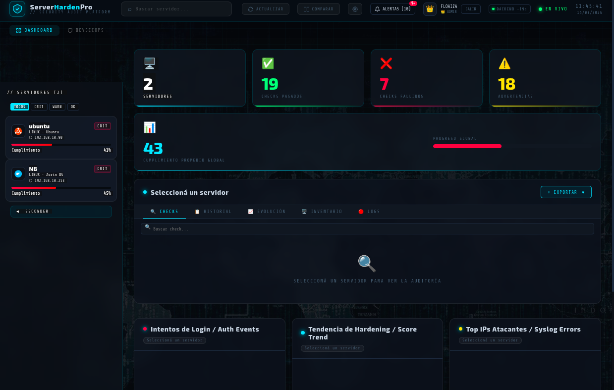
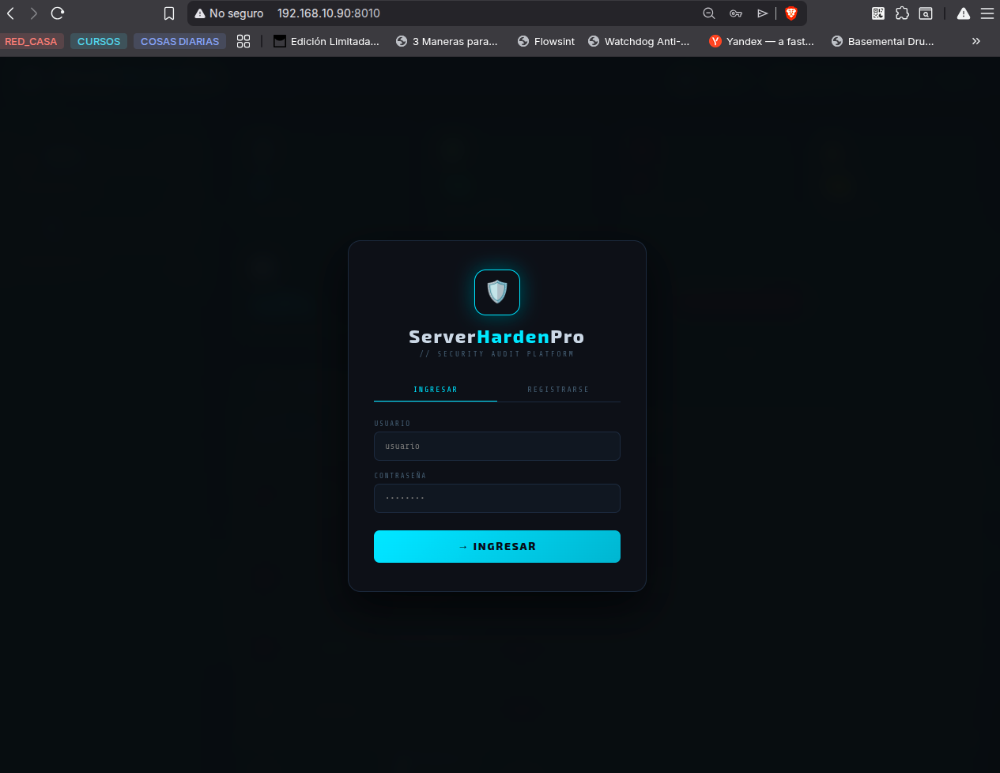

# ServerHardenPro

<div align="center">


**Plataforma profesional de auditoría de hardening para servidores Linux y Windows**

*Professional hardening audit platform for Linux and Windows servers*



</div>

---

## 📋 ¿Qué es ServerHardenPro?

ServerHardenPro ejecuta checklists de hardening en servidores Linux y Windows, envía los resultados a un panel web centralizado en tiempo real y permite visualizar el estado de seguridad de toda tu infraestructura — con HTTPS, WAF, notificaciones, análisis de logs y reportes automáticos.

---

## ✨ Características

| Feature | Descripción |
|---------|-------------|
| 🔐 Auth JWT | Login y registro con roles Admin / Viewer |
| 🔒 HTTPS | Nginx reverse proxy con certificado self-signed |
| 🛡️ CrowdSec WAF | Detección y bloqueo automático de IPs maliciosas |
| 📊 Panel DevSecOps | CVEs, Timeline, Comparativa, Recomendaciones |
| 📈 Gráficos en tiempo real | Auth events, Score trend, Top IPs atacantes |
| 🔔 Notificaciones | Panel lateral con alertas de CRIT, nuevo servidor, check crítico |
| 🔍 Filtros | TODOS / CRIT / WARN / OK en el sidebar |
| 📊 Comparativa | Lado a lado de dos servidores |
| 🐧 Agente Linux | 22 checks — SSH, Firewall, Usuarios, Red, Servicios |
| 🪟 Agente Windows | 25 checks — Contraseñas, RDP, SMB, Defender, UAC |
| 🖥️ Inventario | CPU, RAM, Disco, Uptime, detección VM/Físico |
| 📋 Análisis de Logs | auth.log + syslog + Event Logs Windows, detección de fuerza bruta |
| ⏱️ Uptime | Contador de tiempo activo del backend en el header |
| 🔎 Buscador | Filtrado de checks en tiempo real |
| ⏰ Automatización | Cron (Linux) y Task Scheduler (Windows) |
| 📄 Reportes PDF/Excel | Descargables (solo Admin) |
| 🐳 Docker | Listo para desplegar con un solo comando |
| 🌐 Multi-servidor | Un backend centralizado para toda la red |

---

## 🖼️ Capturas

| Login | Dashboard |
|-------|-----------|
|  |  |

---

## 🏗️ Arquitectura

```
Browser
  │
  ▼
Nginx (443 HTTPS / 80 → redirect)
  │
  ├── CrowdSec Bouncer (bloquea IPs maliciosas)
  │
  ▼
FastAPI Backend (8000 interno)
  │
  ▼
SQLite DB
```

```
ServerHardenPro/
├── frontend/
│   └── dashboard.html
├── agents/
│   ├── linux/
│   │   ├── agent_linux.py
│   │   └── install_cron.sh
│   └── windows/
│       ├── agent_windows.py
│       └── install_task.ps1
├── backend/
│   ├── main.py
│   ├── database.py
│   ├── report_generator.py
│   ├── requirements.txt
│   └── Dockerfile
├── nginx/
│   ├── conf/nginx.conf
│   └── certs/
│       ├── server.crt
│       └── server.key
├── crowdsec/
│   ├── acquis.yaml
│   └── crowdsec_setup.sh
└── docker-compose.yml
```

---

## 🚀 Instalación rápida

### Requisitos
- Docker + Docker Compose
- Python 3.9+ (para los agentes)
- OpenSSL (para generar certificados)

### 1. Clonar el repositorio
```bash
git clone https://github.com/N1x-afl/ServerHardenPro.git
cd ServerHardenPro
```

### 2. Generar certificado SSL self-signed
```bash
mkdir -p nginx/certs
openssl req -x509 -nodes -days 3650 -newkey rsa:2048 \
  -keyout nginx/certs/server.key \
  -out nginx/certs/server.crt \
  -subj "/CN=serverhardenpro.local" \
  -addext "subjectAltName=IP:TU_IP,IP:127.0.0.1,DNS:localhost"
```

### 3. Levantar todos los servicios
```bash
docker compose up -d --build
```

### 4. Configurar CrowdSec (una sola vez)
```bash
bash crowdsec/crowdsec_setup.sh
```

### 5. Acceder al panel
```
https://TU_IP
```

> 💡 La primera vez el browser muestra advertencia de certificado — clic en **Avanzado → Continuar**. No vuelve a aparecer.

### 6. Primer acceso
Hacé clic en **REGISTRARSE** — el primer usuario es automáticamente **Admin**.

---

## 🤖 Ejecutar los agentes

### Agente Linux

```bash
# En el mismo servidor del backend
SHP_API=https://localhost/audit SHP_IP=192.168.1.100 sudo -E python3 agents/linux/agent_linux.py

# En un servidor diferente de la red
SHP_API=https://IP_BACKEND/audit SHP_IP=192.168.1.200 sudo -E python3 agents/linux/agent_linux.py
```

> ⚠️ Ejecutar con `sudo` para acceder a `/var/log/auth.log`

### Agente Windows

```powershell
# PowerShell como Administrador
$env:SHP_API = "https://IP_BACKEND/audit"
$env:SHP_IP  = "192.168.1.50"
python agent_windows.py
```

### Múltiples servidores → un solo backend

Cada servidor de la red puede reportar al mismo backend:
```bash
SHP_API=https://192.168.1.100/audit SHP_IP=192.168.1.200 sudo -E python3 agent_linux.py
```

---

## ⏰ Automatización

### Linux — instalar cron
```bash
sudo bash ~/ServerHardenPro/agents/linux/install_cron.sh
# Pide: URL del backend, intervalo (1h / 6h / 12h / 24h)
```
Logs en `/var/log/shp/agent.log`

### Windows — instalar Task Scheduler
```powershell
# PowerShell como Administrador
.\agents\windows\install_task.ps1
# Pide: URL del backend, IP del equipo, intervalo
```
Logs en `C:\ProgramData\ServerHardenPro\logs\`

---

## 🔒 HTTPS con Nginx

```
Browser → https://IP:443 → Nginx → http://backend:8000
          http://IP:80   → redirige a HTTPS automáticamente
```

El certificado self-signed es ideal para uso en red local. El backend no es accesible directamente desde el exterior.

> ⚠️ Agregá `nginx/certs/server.key` al `.gitignore` — nunca subas la clave privada al repo.

---

## 🛡️ CrowdSec WAF

CrowdSec analiza los logs de Nginx en tiempo real y bloquea automáticamente IPs que realizan ataques:

| Protección | Descripción |
|------------|-------------|
| Fuerza bruta HTTP | Múltiples requests fallidos |
| Escaneo de puertos | Detección de reconocimiento |
| CVEs conocidos | Exploits HTTP documentados |
| Bad bots | Scanners y crawlers maliciosos |

> ✅ Las IPs de red local (`192.168.x.x`) están whitelisted automáticamente — nunca serás bloqueado por accidente.

### Comandos útiles
```bash
# Ver IPs baneadas
docker exec shp_crowdsec cscli decisions list

# Ver alertas detectadas
docker exec shp_crowdsec cscli alerts list

# Ver métricas
docker exec shp_crowdsec cscli metrics

# Banear IP manualmente
docker exec shp_crowdsec cscli decisions add --ip 1.2.3.4

# Desbanear IP
docker exec shp_crowdsec cscli decisions delete --ip 1.2.3.4
```

---

## ⚙️ Variables de entorno

| Variable | Descripción | Default |
|----------|-------------|---------|
| `DB_PATH` | Ruta SQLite | `/app/shp_database.db` |
| `SHP_JWT_SECRET` | Clave JWT | `shp-change-this-secret` |
| `SHP_API` | URL backend (agente) | `https://localhost/audit` |
| `SHP_IP` | IP del equipo (agente) | Detección automática |

> ⚠️ Cambiá `SHP_JWT_SECRET` antes de usar en producción.

---

## 🔐 Sistema de roles

| Acción | Admin | Viewer |
|--------|-------|--------|
| Ver servidores y checks | ✅ | ✅ |
| Ver inventario / logs | ✅ | ✅ |
| Panel DevSecOps | ✅ | ✅ |
| Notificaciones | ✅ | ✅ |
| Comparativa | ✅ | ✅ |
| Descargar PDF / Excel | ✅ | ❌ |

---

## 📡 API Endpoints

| Método | Endpoint | Auth | Descripción |
|--------|----------|------|-------------|
| GET | `/health` | No | Healthcheck + uptime |
| POST | `/auth/register` | No | Registrar usuario |
| POST | `/auth/login` | No | Iniciar sesión |
| GET | `/auth/me` | JWT | Perfil usuario |
| POST | `/audit` | No | Recibir auditoría |
| POST | `/logs` | No | Recibir logs |
| GET | `/servers` | JWT | Listar servidores |
| GET | `/servers/{hostname}` | JWT | Detalle + checks |
| GET | `/servers/{hostname}/history` | JWT | Historial |
| GET | `/servers/{hostname}/inventory` | JWT | Inventario |
| GET | `/servers/{hostname}/logs` | JWT | Logs |
| GET | `/servers/{hostname}/report/pdf` | Admin | PDF |
| GET | `/servers/{hostname}/report/excel` | Admin | Excel |
| GET | `/summary` | JWT | Estadísticas globales |
| WS | `/ws` | No | WebSocket tiempo real |
| GET | `/docs` | No | Swagger UI |

---

## 🔔 Sistema de Notificaciones

Panel lateral deslizable con 3 tipos de alertas:

| Tipo | Trigger |
|------|---------|
| 🆕 Nuevo servidor | Primera vez que reporta |
| 🚨 Score crítico | Score < 40% (máximo 1 alerta/hora) |
| ⚠️ Check crítico | FAIL en Firewall, Telnet, RDP, SMBv1, Defender |

Las notificaciones persisten en `localStorage` entre sesiones.

---

## 🛡️ Panel DevSecOps

| Sección | Descripción |
|---------|-------------|
| **CVEs** | NVD/NIST en tiempo real + fallback local |
| **Timeline** | Eventos de seguridad cronológicos |
| **Comparativa** | Hardening entre servidores |
| **Recomendaciones** | Comandos correctivos por check fallido |

---

## 🔄 Actualizar

```bash
cd ~/ServerHardenPro
git pull
docker compose down && docker compose up -d --build
```

Solo frontend (sin rebuild):
```bash
git pull && docker compose restart
```

---

## 🔧 Troubleshooting

Ver [TROUBLESHOOTING.md](TROUBLESHOOTING.md) para errores detallados.

**No conecta al backend:**
```bash
docker ps | grep shp
docker compose up -d
```

**Error Mixed Content (HTTP/HTTPS):**
```javascript
// F12 → Console
localStorage.clear(); location.reload();
// En Settings usar: https://IP (sin puerto)
```

**Certificado rechazado:**
En el browser → Avanzado → Continuar de todas formas

**IP muestra 127.0.0.1:**
```bash
SHP_IP=192.168.1.100 sudo -E python3 agent_linux.py
```

**CrowdSec bloqueó mi IP:**
```bash
docker exec shp_crowdsec cscli decisions delete --ip TU_IP
```

---

## 🛠️ Stack tecnológico

| Capa | Tecnología |
|------|-----------|
| WAF | CrowdSec + Bouncer |
| Reverse proxy | Nginx + SSL self-signed |
| Backend | FastAPI + Uvicorn |
| Auth | JWT HS256 |
| DB | SQLite |
| Frontend | HTML5 + CSS3 + JS vanilla |
| Gráficos | Chart.js |
| Reportes | ReportLab + OpenPyXL |
| Tiempo real | WebSockets |
| Contenedores | Docker + Compose |

---

## 🤝 Contribuciones

1. Fork → branch → commit → PR

Áreas: nuevos checks, soporte RHEL/Alpine/macOS, traducciones, nuevos escenarios CrowdSec.

---

## 📄 Licencia

MIT © 2025 — ServerHardenPro

---

*// ServerHardenPro v0.7.0 — FastAPI + Nginx + CrowdSec + SQLite + WebSockets + Chart.js*
